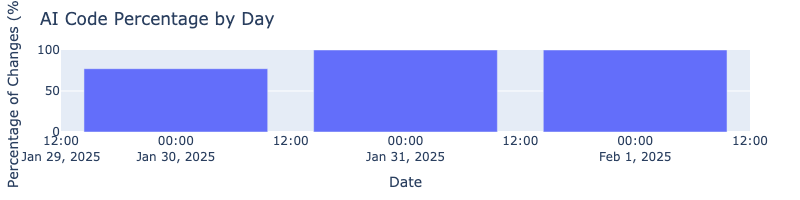
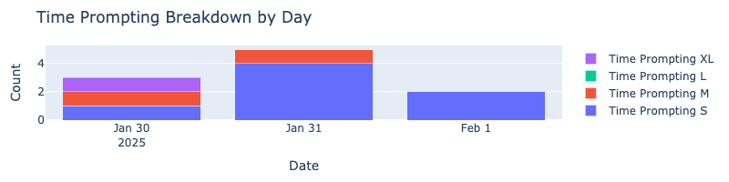

# AI Code Tracker

Track and analyze the proportion of AI-assisted vs. human-written code in your Git repositories.

Heavily inspired by [Aider's Release History](https://aider.chat/HISTORY.html)

[](charts/ai_code_percentage.html)
[](charts/lines_of_code.html)
[](charts/time_prompting.html)

## Features

- Analyze Git repositories to determine AI vs. human code contributions
- Track contributions over time with daily or weekly aggregation
- Smart file filtering for relevant source files
- Track AI commit metadata including time-prompting metrics (S/M/L/XL)
- Detailed statistics including lines added/deleted and percentage of AI changes
- Generate interactive visualizations:
  - AI Code Percentage by Day
  - New Lines of Code by Day (AI vs. Human)
  - Time Prompting Breakdown by Day

## Installation

```bash
# Clone the repository
git clone https://github.com/mrmattwright/ai-code-tracker
cd ai-code-tracker

# Install dependencies
uv sync
```

## Usage

```bash
# Basic usage with date range
uv run contribution_tracker.py --start-date 2025-01-01 --end-date 2025-03-01

# Group by week instead of day
uv run contribution_tracker.py --start-date 2025-01-01 --group-by week

# Generate interactive charts
uv run contribution_tracker.py --start-date 2025-01-01 --output-dir ./charts

# Run tests
uv run pytest
```

### Options

- `--start-date`: Start date for analysis (YYYY-MM-DD) [required]
- `--end-date`: End date for analysis (YYYY-MM-DD) [default: current date]
- `--group-by`: Group results by 'day' or 'week' [default: day]
- `--output-dir`: Directory to save charts (enables chart generation) [optional]
- `--chart-format`: Chart output format (html, png, pdf) [default: html]

### Sample Output

```json
{
    "date": "2025-01-30",
    "ai_commits": 2,
    "total_commits": 7,
    "human_commits": 5,
    "ai_lines_added": 302,
    "ai_lines_deleted": 2,
    "ai_total_changes": 304,
    "human_lines_added": 337,
    "human_lines_deleted": 0,
    "human_total_changes": 337,
    "percentage_total_changes_ai": 47.43,
    "time_prompting_S": 1,
    "time_prompting_M": 1,
    "time_prompting_L": 0,
    "time_prompting_XL": 0
}
```

### Generated Charts

When using the `--output-dir` option, the tool generates three interactive charts:

1. **AI Code Percentage by Day**: Line chart showing the percentage of AI-written code over time
2. **New Lines of Code by Day**: Stacked bar chart comparing AI and human-added lines
3. **Time Prompting Breakdown**: Stacked bar chart showing the distribution of time-prompting categories (S/M/L/XL)

Charts are generated in HTML format by default for maximum interactivity. PNG and PDF formats are also supported if the `kaleido` package is installed.

## File Filtering

By default, the tool analyzes files with these extensions:
- `.js`
- `.py`
- `.scm`
- `.sh`
- `Dockerfile`
- `.md`
- `.github/workflows/*.yml`

Excluded patterns:
- `tests/fixtures/watch/*`
- `**/prompts.py`

## Contributing

Pull requests are welcome. For major changes, please open an issue first to discuss what you would like to change.

## License

[MIT](https://choosealicense.com/licenses/mit/)
